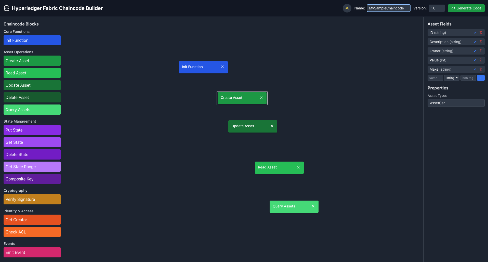

# Hyperledger Fabric Chaincode Builder

A visual drag-and-drop interface for generating Hyperledger Fabric chaincode in Go. This application allows developers to rapidly prototype and create chaincode by visually connecting blocks that represent different chaincode operations.

## Features

- **Visual Block Programming**: Drag and drop blocks to design your chaincode logic
- **Multiple Block Types**: Support for core functions, asset operations, state management, crypto, identity, and events
- **Asset Management**: 
  - Create custom asset types with configurable fields
  - Edit and delete asset fields, including default ones (ID, Description, Owner, Value)
  - Define field properties including name, type, and JSON tags
- **Code Generation**: Automatic Go chaincode generation based on your visual design
- **Light/Dark Mode**: User-selectable theme preferences
- **Adjustable Interface**: Resizable property panel with persistent width settings
- **Modular Architecture**: Well-organized component structure for better maintainability

## Usage Guide

1. **Design Your Chaincode**: 
   - Drag blocks from the left panel onto the canvas
   - Connect blocks to create your chaincode flow
   - Configure block properties in the right panel

2. **Define Asset Structure**:
   - Add, edit, or delete asset fields in the property panel
   - Customize field types and JSON tags
   - Resize the property panel by dragging its left edge
   - Double-click the resize handle to reset to default width

3. **Generate Code**:
   - Click the "Generate Code" button to view the Go chaincode
   - Copy the generated code or export it to a file

## Application Structure

The application is built with a modular architecture:

- `src/components/`: UI components (Header, BlockPalette, Canvas, PropertyPanel, etc.)
- `src/utils/`: Utility functions and code generation logic
- `src/ThemeContext.jsx`: Theme management

## Development

### Built With

- React 19
- Vite 6
- TailwindCSS
- Lucide React icons

### Scripts

- `npm run dev`: Start development server
- `npm run build`: Build for production
- `npm run preview`: Preview production build
- `npm run lint`: Run ESLint

## Contributing

Contributions are welcome! Please feel free to submit a Pull Request.

1. Fork the project
2. Create your feature branch (`git checkout -b feature/amazing-feature`)
3. Commit your changes (`git commit -m 'Add some amazing feature'`)
4. Push to the branch (`git push origin feature/amazing-feature`)
5. Open a Pull Request

## License

This project is licensed under the MIT License - see the LICENSE file for details.

## Acknowledgments

- Hyperledger Fabric community
- React and Vite teams
- All contributors to this project
